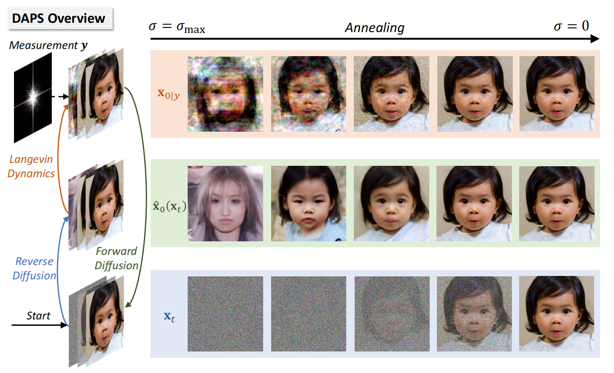

# DAPS: Improving Diffusion Inverse Problem Solving with Decoupled Noise Annealing (CVPR 2025 Oral)

### 📝 [Paper](https://arxiv.org/abs/2407.01521) | 🌐 [Project Page](https://daps-inverse-problem.github.io/)


## 🔥 News:

* 🎉 **April 2025**: DAPS is accepted as **CVPR 2025 Oral** Presentation!

* ⚙️ **March 2025**: Major code restructuring for enhanced modularity:

  * update diffusion schulers in `cores/scheduler.py`.
  * update MCMC sampler to support different algorithms and approximations in `cores/mcmc.py`.
  * enhance LatentDAPS with $\texttt{HMC}$ which sustantially improve the performance.
  * move the previous code structure to `legacy` branch

* 🎉 **Feb 2025**: DAPS has been accepted by **CVPR 2025**! 

  

## 🚀 Introduction

We propose a new method called **Decoupled Annealing Posterior Sampling (DAPS)** that relies on a novel noise annealing process to solve posterior sampling with diffusion prior. Specifically, we decouple consecutive steps in a diffusion sampling trajectory, allowing them to vary considerably from one another while ensuring their time-marginals anneal to the true posterior as we reduce noise levels. 



This approach enables the exploration of a larger solution space, improving the success rate for accurate reconstructions. We demonstrate that DAPS significantly improves sample quality and stability across multiple image restoration tasks, particularly in complicated nonlinear inverse problems.


## 🕹️ Try and Play with DAPS on Colab!

| Link                                                         | Description                                                |
| ------------------------------------------------------------ | ---------------------------------------------------------- |
| [](https://colab.research.google.com/github/zhangbingliang2019/DAPS/blob/main/scripts/DAPS_Demo.ipynb) | Try DAPS on demo datasets with different diffusion models. |
| [](https://colab.research.google.com/github/zhangbingliang2019/DAPS/blob/main/scripts/Customization.ipynb) | Customizing DAPS for new inverse problems.                 |


## 💻 Local Setup

### 1. Prepare the environment


- python 3.8  
- PyTorch 2.3  
- CUDA 12.1  

Other versions of PyTorch with proper CUDA should work but are not fully tested.

```bash
# in DAPS folder
conda create -n DAPS python=3.8
conda activate DAPS

pip install -r requirements.txt

# (optional) install PyTorch with proper CUDA
conda install pytorch==2.3.0 torchvision==0.18.0 torchaudio==2.3.0 pytorch-cuda=12.1 -c pytorch -c nvidia
```

We use [bkse](https://github.com/VinAIResearch/blur-kernel-space-exploring) for nonlinear blurring and [motionblur](https://github.com/LeviBorodenko/motionblur) for motion blur.

### 2. Prepare the pretrained checkpoint & test dataset

You can directly use our provided script to download **all of them**:

```
sh download.sh
```

Or you can manually download them by following commands:

<details>
  <summary><strong>2.1 pixel diffusion model</strong></summary>


Download the public available FFHQ and ImageNet checkpoint (ffhq_10m.pt, imagenet256.pt) [here](https://drive.google.com/drive/folders/1jElnRoFv7b31fG0v6pTSQkelbSX3xGZh).

  ```bash
# in DAPS folder

mkdir checkpoints
mv {DOWNLOAD_DIR}/ffqh_10m.pt checkpoints/ffhq256.pt
mv {DOWNLOAD_DIR}/imagenet256.pt.pt checkpoints/imagenet256.pt
  ```

</details>

<details>
  <summary><strong>2.2 latent diffusion model (LDM)</strong></summary>

Download the public available LDM checkpoint for FFHQ and ImageNet with following commands:

  ```bash
# in DAPS folder

wget https://ommer-lab.com/files/latent-diffusion/ffhq.zip -P ./checkpoints
unzip checkpoints/ffhq.zip -d ./checkpoints
mv checkpoints/model.ckpt checkpoints/ldm_ffhq256.pt
rm checkpoints/ffhq.zip

wget https://ommer-lab.com/files/latent-diffusion/nitro/cin/model.ckpt -P ./checkpoints/
mv checkpoints/model.ckpt checkpoints/ldm_imagenet256.pt
  ```

</details>

<details>
  <summary><strong>2.3 stable diffusion</strong></summary>

Checkpoints will be automatically downloaded.

</details>

<details>
  <summary><strong>2.4 nonlinear deblur model</strong></summary>

For nonlinear deblur task, we need the pretrained model from [bkse](https://github.com/VinAIResearch/blur-kernel-space-exploring) at [here](https://drive.google.com/file/d/1vRoDpIsrTRYZKsOMPNbPcMtFDpCT6Foy/view?usp=drive_link):

```bash
# in DAPS folder

mv {DOWNLOAD_DIR}/GOPRO_wVAE.pth forward_operator/bkse/experiments/pretrained
```

</details>

<details>
  <summary><strong>2.5 test dataset</strong></summary>

For convenience, we provide the used [test dataset](https://drive.google.com/drive/folders/1RHNif32W0hvB4M75ppG1ypTChy-W3q3Z?usp=sharing) (subset of 100 images of FFHQ and ImageNet dataset):

```bash
# in DAPS folder

gdown https://drive.google.com/uc?id=1IzbnLWPpuIw6Z2E4IKrRByh6ihDE5QLO -O datasets/test-ffhq.zip
unzip datasets/test-ffhq.zip -d ./datasets
rm datasets/test-ffhq.zip

gdown https://drive.google.com/uc?id=1pqVO-LYrRRL4bVxUidvy-Eb22edpuFCs -O datasets/test-imagenet.zip
unzip datasets/test-imagenet.zip -d ./datasets
rm datasets/test-imagenet.zip
```

</details>

### 3. Posterior sampling with DAPS

Now you are ready to run. For **phase retrieval** with `DAPS-1k` and `ffhq256ddpm` model in 4 runs for 10 demo FFHQ images in `dataset/demo-ffhq`:

```
python posterior_sample.py \
+data=demo-ffhq \
+model=ffhq256ddpm \
+task=phase_retrieval \
+sampler=edm_daps \
task_group=pixel \
save_dir=results \
num_runs=4 \
sampler.diffusion_scheduler_config.num_steps=5 \
sampler.annealing_scheduler_config.num_steps=200 \
batch_size=10 \
data.start_id=0 data.end_id=10 \
name=phase_retrieval_demo \
gpu=0
```

It takes about 8 minutes (2 for each run) and 6G GPU memory on a single NVIDIA A100-SXM4-80GB GPU. The results are saved at foloder `\results`.


### 4. Benchmarking and reproduction

#### Full commands on test dataset

We provide the full comands used to reproduce the results in paper are provided in `commands` folder:

* pixel space diffusion: `commands/pixel.sh`
* latent diffusion: `commands/ldm.sh`
* stable diffusion: `commands/sd.sh`


#### Supported diffusion models

| Model                                                        | Dataset  | Model Config Name     | Sampler         | Task Group |
| ------------------------------------------------------------ | -------- | --------------------- | --------------- | ---------- |
| [ffhq-256](https://drive.google.com/drive/folders/1jElnRoFv7b31fG0v6pTSQkelbSX3xGZh) | FFHQ     | ffhq256ddpm           | edm_daps        | pixel      |
| [imagenet-256](https://drive.google.com/drive/folders/1jElnRoFv7b31fG0v6pTSQkelbSX3xGZh) | ImageNet | imagenet256ddpm       | edm_daps        | pixel      |
| [ldm-ffhq-256](https://github.com/CompVis/latent-diffusion?tab=readme-ov-file#unconditional-models) | FFHQ     | ffhq256ldm            | latent_edm_daps | ldm        |
| [ldm-imagenet-256](https://github.com/CompVis/latent-diffusion?tab=readme-ov-file#class-conditional-imagenet) | ImageNet | imagenet256ldm        | latent_edm_daps | ldm        |
| [sd-v1.5](https://huggingface.co/stable-diffusion-v1-5/stable-diffusion-v1-5) | Any      | stable-diffusion-v1.5 | sd_edm_daps     | sd         |
| [sd-v2.1](https://huggingface.co/stabilityai/stable-diffusion-2-1) | Any      | stable-diffusion-v2.1 | sd_edm_daps     | sd         |


#### Command template

```
python posterior_sample.py \
+data={DATASET_CONFIG_NAME} \
+model={MODEL_CONFIG_NAME} \
+task={TASK_CONFIG_NAME} \
+sampler={SAMPLER_CONFIG_NAME} \
task_group={pixel, ldm, sd} # choose the used task parameters group \
save_dir=results \
num_runs={NUMBER_OF_RUNS} \
sampler.diffusion_scheduler_config.num_steps={DIFFUSION_ODE_STEPS} \
sampler.annealing_scheduler_config.num_steps={ANNEALING_STEPS} \
batch_size=100 \
name={SUB_FOLDER_NAME} \
gpu=0
```

Currently supported tasks are:

* `phase_retrieval`: phase retrival of oversample ratio of 2.0

* `down_sampling`: super resolution (x4)

* `inpainting`:  128x128 box inpainting

* `inpainting_rand`: 70% random inpainting 

* `gaussian_blur`: gaussian deblur of kernel size 61 and intensity 3

* `motion_blur`: gaussian deblur of kernel size 61 and intensity 0.5

* `nonlinear_blur`: nonlinear deblur of default setting in bkse repo

* `hdr`: high dynamic range reconstruction of factor 2 


## Citation

If you find our work interesting, please consider citing

```
@misc{zhang2024improvingdiffusioninverseproblem,
      title={Improving Diffusion Inverse Problem Solving with Decoupled Noise Annealing}, 
      author={Bingliang Zhang and Wenda Chu and Julius Berner and Chenlin Meng and Anima Anandkumar and Yang Song},
      year={2024},
      eprint={2407.01521},
      archivePrefix={arXiv},
      primaryClass={cs.LG},
      url={https://arxiv.org/abs/2407.01521}, 
}
```
