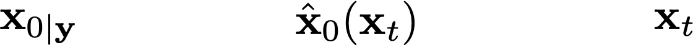

# Decoupled Annealing Posterior Sampling

#### [website](https:) |  [paper](https:)

(PLACE HOLDER: gifs for method flow and visualization of trajectories)

<p align="center">
  
    
</p>


## Results

(PLACE HOLDER: select and put some results)


## Getting started

#### 1. Prepare the Conda environment

```
# in daps folder

conda create -n daps python=3.8
conda activate daps

pip install -r requirements.txt
```

We use [bkse](https://github.com/VinAIResearch/blur-kernel-space-exploring) for nonlinear blurring and [motionblur](https://github.com/LeviBorodenko/motionblur) for motion blur. **No further action required then**.


#### 2. Prepare the pretrainedcheckpoint

Download the public available FFHQ checkpoint (ffhq_10m.pt) [here](https://drive.google.com/drive/folders/1jElnRoFv7b31fG0v6pTSQkelbSX3xGZh).

```
# in daps folder

mkdir checkpoint
mv {DOWNLOAD_DIR}/ffqh_10m.pt checkpoint/ffhq256.pt
```


**(Optional)** For nonlinear deblur task, we need the pretrained model from [bkse](https://github.com/VinAIResearch/blur-kernel-space-exploring) at [here](https://drive.google.com/file/d/1vRoDpIsrTRYZKsOMPNbPcMtFDpCT6Foy/view?usp=drive_link):

```
# in daps folder

mv {DOWNLOAD_DIR}/GOPRO_wVAE.pth forward_operator/bkse/experiments/pretrained
```


#### 3.  (Optional) Prepare the dataset (or use provided examples)

You can add any FFHQ256 images you like to `dataset/demo` folder


#### 4. Sample

Make a folder to save results:

```
mkdir results
```

##### Phase Retrieval

Now you are ready for run. For **phase retrieval** with DAPS-1k in 4 runs for $10$ demo images in `dataset/demo`:

```
python posterior_sample.py \
+data=demo \
+model=ffhq256ddpm \
+task=phase_retrieval \
+sampler=edm_daps \
save_dir=results \
num_runs=4 \
sampler.diffusion_scheduler_config.num_steps=5 \
sampler.annealing_scheduler_config.num_steps=200 \
batch_size=10 \
data.start_id=0 data.end_id=10 \
name=phase_retrieval_demo \
gpu=0
```

It takes about $8$ minutes ($2$ for each run) and $6G$ GPU memory on a single NVIDIA A100-SXM4-80GB GPU. The results are saved at foloder `\results`. 


##### All Tasks

```
python posterior_sample.py \
+data=demo \
+model=ffhq256ddpm \
+task={TASK_NAME} \
+sampler=edm_daps \
save_dir=results \
num_runs=4 \
sampler.diffusion_scheduler_config.num_steps=5 \
sampler.annealing_scheduler_config.num_steps=200 \
batch_size=10 \
data.start_id=0 data.end_id=10 \
name={SUB_FOLDER_NAME} \
gpu=0
```

replace the {TASK_NAME} by one of following:

* `phase_retrieval`: phase retrival of oversample ratio of $2.0$

* `down_sampling`: super resolution ($\times 4$)
* `inpainting`:  128x128 box inpainting
* `inpainting_rand`: $70\%$ random inpainting 

* `gaussian_blur`: gaussian deblur of kernel size $61$ and intensity $3$
* `motion_blur`: gaussian deblur of kernel size $61$ and intensity $0.5$

* `nonlinear_blur`: nonlinear deblur of default setting in bkse repo
* `hdr`: high dynamic range reconstruction of factor $2$ 


## Reference

```
@misc{zhang2024improvingdiffusioninverseproblem,
      title={Improving Diffusion Inverse Problem Solving with Decoupled Noise Annealing}, 
      author={Bingliang Zhang and Wenda Chu and Julius Berner and Chenlin Meng and Anima Anandkumar and Yang Song},
      year={2024},
      eprint={2407.01521},
      archivePrefix={arXiv},
      primaryClass={cs.LG},
      url={https://arxiv.org/abs/2407.01521}, 
}
```
